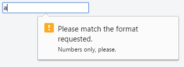
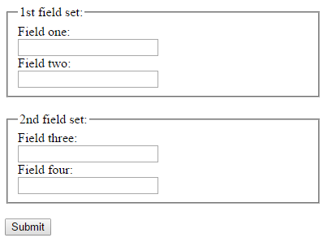

**HTML**

# Validation

HTML input validation is done automatically by the browser based on special attributes on the input element. It could partially or completely replace JavaScript input validation. This kind of validation can be circumvented by the user via specially crafted HTTP requests, so it does not replace server-side input validation. The validation only occurs when attempting to submit the form, so all restricted inputs must be inside a form in order for validation to occur (unless you're using JavaScript). Keep in mind that inputs which are disabled or read-only will not trigger validation.

Some newer input types (like `email`, `url`, `tel`, `date`, and many more ) are automatically validated and do not require your own validation constraints.

## Required

Use the `required` attribute to indicate that a field must be completed in order to pass validation.

```html
<input required>
```

## Minimum / maximum length

Use the `minlength` and `maxlength` attributes to indicate length requirements. Most browsers will prevent the user from typing more than *max* characters into the box, preventing them from making their entry invalid even before they attempt submission.

```html
<input minlength="3">
<input maxlength="15">
<input minlength="3" maxlength="15">
```

## Specifying a range

Use `min` and `max` attributes to restrict the range of numbers a user can input into an input of type `number` or `range`.

```html
Marks: <input type="number" size="6" name="marks" min="0" max="100" />
Subject Feedback: <input type="range" size="2" name="feedback" min="1" max="5" />
```

## Match a Pattern

For more control, use the `pattern` attribute to specify any regular expression that must be matched in order to pass validation. You can also specify a `title`, which is included in the validation message if the field doesn't pass.

```html
<input pattern="\d*" title="Numbers only, please.">
```

Here's the message shown in Google Chrome version 51 when attempting to submit the form with an invalid value inside this field:



Not all browsers display a message for invalid patterns, although there is full support among most used modern browsers. Check the latest support on [CanIUse](http://caniuse.com/#feat=input-pattern) and implement accordingly.

## Accept file type

For input fields of type `file`, it is possible to accept only certain types of files, such as videos, images, audios, specific file extensions, or certain [media types](http://www.iana.org/assignments/media-types/media-types.xhtml). For example:
```html
<input type="file" accept="image/*" title="Only images are allowed">
```
Multiple values can be specified with a comma, e.g.:
```html
<input type="file" accept="image/*,.rar,application/zip">
```

## Preventing validation

Adding `novalidate` attribute to the `form` element or `formnovalidate` attribute to the submit button, prevents validation on form elements. For example:
```html
<form>
    <input type="text" name="name" required>
    <input type="email" name="email" required>
    <input pattern="\d*" name="number" required>

    <input type="submit" value="Publish"> <!-- form will be validated -->
    <input type="submit" value="Save" formnovalidate> <!-- form will NOT be validated -->
</form>
```
The form has fields that are required for "publishing" the draft but aren’t required for "saving" the draft.

# Inputs

As with other HTML5 void elements, `<input>` is self-closing and may be written `<input />`. HTML5 does not require this slash.

## Text
<input>
```html
<input type="text">
<input> <!-- type="text" is the default, so you can omit it -->
```

The most basic input type and the default input if no `type` is specified. This input type defines a single-line text field with line-breaks automatically removed from the input value. All other characters can be entered into this. `<input>` elements are used within a `<form>` element to declare input controls that allow users to input data.

The default width of a text field input is 20 characters. This can be changed by specifying a value for the size attribute like this:

```html
<input type="text" size="50">
```

The size attribute is distinctly different than setting a width with CSS. Using a width defines a specific value (in number of pixel, percentage of the parent element, etc.) that the input must always be wide. Using the `size` calculates the amount of width to allocate based on the font being used and how wide the characters normally are.

**Note:** Using the `size` attribute does not actually limit the number of characters which can be entered into the box, only how wide the box is displayed. For limiting the length, see Input Validation, below.

An `<input>` field only allows one line of text. If you need a multi-line text input for substantial amount of text, use a `<textarea>` element instead.

## Checkbox and radio buttons

The simplest checkbox or radio button is an `<input>` element with a `type` attribute of `checkbox` or `radio`, respectively:

<input type="checkbox"> `<input type="checkbox">`
<input type="radio"> `<input type="radio">`

### Attributes

#### value

Like any other input element, the `value` attribute specifies the string value to associate with the button in the event of form submission. However, checkboxes and radio buttons are special in that when the value is omitted, it defaults to `on` when submitted, rather than sending a blank value. The `value` attribute is not reflected in the button's appearance.

#### checked

The `checked` attribute specifies the initial state of a checkbox or radio button. This is a boolean attribute and may be omitted.

Each of these are valid, equivalent ways to define a checked radio button:

```html
<input checked>
<input checked="">
<input checked="checked">
<input checked="ChEcKeD">
```
The absence of the `checked` attribute is the only valid syntax for an unchecked button:

```html
<input type="radio">
<input type="checkbox">
```

When resetting a `<form>`, checkboxes and radio buttons revert to the state of their `checked` attribute.

### Accessibility

#### Labels

To give context to the buttons and show users what each button is for, each of them should have a label. This can be done using a `<label>` element to wrap the button. Also, this makes the label clickable, so you select the corresponding button.

```html
<label>
  <input type="radio" name="color" value="#F00">
  Red
</label>
```

Instead of wrapping the `<input>` tag, you can also give the `<label>` a `for` attribute set to the `id` attribute of the button:

```html
<input type="checkbox" name="color" value="#F00" id="red">
<label for="red">Red</label>
```

#### Button groups

Since each radio button affects the others in the group, it is common to provide a label or context for the entire group of radio buttons.

To provide a label for the entire group, the radio buttons should be included in a `<fieldset>` element with a `<legend>` element within it.

```html
<fieldset>
  <legend>Theme color:</legend>
  <p>
    <input type="radio" name="color" id="red" value="#F00">
    <label for="red">Red</label>
  </p>
  <p>
    <input type="radio" name="color" id="green" value="#0F0">
    <label for="green">Green</label>
  </p>
  <p>
    <input type="radio" name="color" id="blue" value="#00F">
    <label for="blue">Blue</label>
  </p>
</fieldset>
```

Checkboxes can also be grouped in a similar fashion, with a fieldset and legend identifying the group of related checkboxes. You should also keep the legend short, since some combinations of browsers and screen readers read the legend before each input field in the fieldset.

Checkboxes should not share the same name because they are not mutually exclusive. Doing this will result in the form submitting multiple values for the same key and not all server-side languages handle this in the same way (undefined behavior). Each checkbox should either have a unique name, or use a set of square brackets (`[]`) to indicate that the form should submit an array of values for that key. Which method you choose should depend on how you plan to handle the form data client-side or server-side.

## Color
<input type="color" name="favcolor" value="#ff0000">
```html
<input type="color" name="favcolor" value="#ff0000">
```

In supporting browsers, the input element with a type attribute whose value is color creates a button-like control, with a color equal to the value of color attribute (defaults to black if value is not specified or is an invalid hexadecimal format). Clicking this button opens the operating system's color widget, which allows user to select a color. Fallback for browsers which do not support this input type is a regular `<input type=text>`.

## Password

<input type="password" name="password">

```html
<input type="password" name="password">
```

## File

<input type="file" name="fileSubmission">

```html
<input type="file" name="fileSubmission">
```

File inputs allow users to select a file from their local filesystem for use with the current page. If used in conjunction with a `form` element, they can be used to allow users to upload files to a server.

The following example allows users to use the file input to select a `file` from their filesystem and upload that file to a script on the server named `upload_file.php`.

```html
<form action="upload_file.php" method="post" enctype="multipart/form-data">
    Select file to upload:
    <input type="file" name="fileSubmission" id="fileSubmission">
    <input type="submit" value="Upload your file" name="submit">
</form>
```

### Multiple files

Adding the `multiple` attribute the user will be able to select more than one file:

```html
<input type="file" name="fileSubmission" id="fileSubmission" multiple>
```

### Filetypes

Accept attribute specifies the types of files that user can select. E.g. .png, .gif, .jpeg.

```html
<input type="file" name="fileSubmission" accept="image/x-png,image/gif,image/jpeg" />
```

## Button
<input type="button" value="Button Text">
```html
<input type="button" value="Button Text">
```
Buttons can be used for triggering actions to occur on the page, without submitting the form. You can also use the `<button>` element if you require a button that can be more easily styled or contain other elements:
```html
<button>Button Text</button>
```
Buttons are typically used with an "onclick" event:
```html
<input type="button" onclick="alert('hello world!')" value="Click Me">
<button type="button" onclick="alert('hello world!')">Click Me</button>
```

### Types
```html
<button type="">
```
- `submit`: (default) Submit the form data to the server
- `reset`: Reset the form controls to their default values
- `button`: No default behavior. Behavior can be defind with JavaScript.


## Submit

<input type="submit" value="Submit">
```html
<input type="submit" value="Submit">
```

A submit input creates a button which submits the form it is inside when clicked.

You can also use the `<button>` element if you require a submit button that can be more easily styled or contain other elements:

```html
<button type="submit">
   Submit
</button>
```

## Reset
<input type="reset" value="Reset">
```html
<input type="reset" value="Reset">
```
Reset form controls to their default values.

## Hidden
<input type="hidden" name="inputName" value="inputValue">  
```html
<input type="hidden" name="inputName" value="inputValue">  
```
A hidden input won't be visible to the user, but its value will be sent to the server when the form is submitted nonetheless.

Don't rely on this for security-sensitive information such as user IDs; it's possible for users to alter their data befor it's sent.

## Tel
<input type="tel" value="+8400000000">
```html
<input type="tel" value="+8400000000">
```
Represents a one-line plain-text edit control for entering a telephone number.

## Email

<form>
  <label>E-mail: <label>
  <input type="email" name="email">
</form>

```html
<form>
  <label>E-mail: <label>
  <input type="email" name="email">
</form>
```

Used for input fields that should contain an e-mail address. E-mail address can be automatically validated when submitted depending on browser support.

## Number

<input type="number" value="0" name="quantity">
```html
<input type="number" value="0" name="quantity">
```

Provides a precise control for setting the element's value to a string representing a number.

Please note that this field does not guarantee to have a correct number. It allows all the symbols which could be used in any real number, e.g. `e1e-,0`.

## Range
<input type="range" min="" max="" step="" />
```html
<input type="range" min="" max="" step="" />
```

A control for entering a number whose exact value is not important.

## Image
```html
<input type="image" src="img.png" alt="image_name" height="50px" width="50px"/>
```
A form control that looks like an image. Used to create graphical "submit" buttons.

## Search
<input type="search" name="googlesearch">
```html
<input type="search" name="googlesearch">
```
Input type search is used for textual search. It will add magnifier symbol next to space for text on most browsers.

## Week
<input type="week" />
```html
<input type="week" />
```
Dependent on browser support, a control will show for entering a week-year number and a week number with no time zone.

## DateTime (Global)
<label>Meeting time: <input type=datetime name="meeting.start"></label>
```html
<label>Meeting time: <input type=datetime name="meeting.start"></label>
```
Can be set to a string representing a global date and time (with timezone information).

## DateTime-Local
<input type="datetime-local" />
```html
<input type="datetime-local" />
```
Dependent on browser support, a date and time picker will pop up on screen for you to choose a date and time.

## Month
<input type="month" />
```html
<input type="month" />
```
Dependent on browser support, a control will show to pick the month.

## Time
<input type="time" />
```html
<input type="time" />
```
Accepts a string representing a time. The format is defined in [RFC 3339](https://tools.ietf.org/html/rfc3339) and should be a partial-time such as `19:04:39` or `08:20:39.04`.

Currently supported by all versions of Edge, Chrome, Opera, and Chrome for Android, as well as by Android Browser 4.4 and up. Safari for iOS offers partial support, not supporting `min`, `max`, and `step` attributes.

## URL
<input type="url" name="Homepage">
```html
<input type="url" name="Homepage">
```
This is used for input fields that should contain a URL address.

Depending on browser support, the `url` field can be automatically validated when submitted.

Some smartphones recognize the `url` type, and adds ".com" to the keyboard to match URL input.

## Date
<input type="date" />
```html
<input type="date" />
```
A date picker will pop up on screen for you to choose a date. This is not supported in Firefox or Internet Explorer.

# Forms

## Submitting

### The Action attribute

```html
<form action="action.php">
```

The action attribute defines the action to be performed when the form is submitted, which usually leads to a script that collects the information submitted and works with it. if you leave it blank, it will send it to the same file.

### The Method attribute

The method attribute is used to define the HTTP method of the form which is either GET or POST.

```html
<form action="action.php" method="get">
<form action="action.php" method="post">
```

The GET method is mostly used to *get* data, for example to receive a post by its ID or name, or to submit a search query. The GET method will append the form data to the URL specified in the action attribute.

```
www.example.com/action.php?firstname=Mickey&lastname=Mouse
```
The POST method is used when submitting data to a script. The POST method does not append the form data to the action URL but sends using the request body.

To submit the data from the form correctly, a name attribute name must be specified. As an example let's send the value of the field and set its name to `lastname`:

```html
<input type="text" name="lastname" value="Mouse">
```

### More attributes

```html
<form action="action.php" method="post" target="_blank" accept-charset="UTF-8"
enctype="application/x-www-form-urlencoded" autocomplete="off" novalidate>

<!-- form elements -->

</form>
```

## Target attribute in form tag

The target attribute specifies a name or a keyword that indicates where to display the response that is received after submitting the form.

The target attribute defines a name of, or keyword for, a browsing context (e.g. tab, window, or inline frame).

```html
<form target="_blank">
```

### Attribute values

- `_self` (default): The response is displayed in the same frame
- `_blank`: The response is displayed in a new window or tab
- `_parent`: The response is displayed in the parent frame
- `_top`: The response is displayed in the full body of the window
- *framename*: The response is displayed in a named iframe

Frames and framesets are not supported in HTML5, so the `_parent`, `_top` and `framename` values are now mostly used with iframes.

## Grouping input fields



```html
<form>
  <fieldset>
     <legend>1st field set:</legend>
     <label>Field one:
       <input type="text">
	  </label><br>
	  <label>Field two:
       <input type="text"><br>
	  </label>
  </fieldset><br>
  <fieldset>
     <legend>2nd field set:</legend>
     <label>Field three:
       <input type="text">
	  </label><br>
     <label>Field four:
       <input type="text">
	  </label>
  </fieldset><br>
  <input type="submit" value="Submit">
</form>
```

## Uploading files

Images and files can be uploaded/submitted to server by setting the `enctype` attribute of the `<form>` tag to `multipart/form-data`. `enctype` specifies how form data will be encoded when it's submitted to the server.

```html
<form method="post" enctype="multipart/form-data" action="upload.php">
    <input type="file" name="pic" />
    <input type="submit" value="Upload" />
</form>
```

# Link that runs JavaScript

Simply use the `javascript:` protocol to run the text as JavaScript instead of opening it as a normal link:

```html
<a href="javascript:myFunction();">Run Code</a>
```

You can also achieve the same thing using the onclick attribute:

```html
<a href="#" onclick="myFunction(); return false;">Run Code</a>
```
The `return false;` is necessary to prevent your page from scrolling to the top when the link to `#` is clicked. Make sure to include all code you'd like to run before it, as returning will stop execution of further code.

Also noteworthy, you can include an exclamation mark `!` after the hashtag in order to prevent the page from scrolling to the top. This works because any invalid slug will cause the link to not scroll *anywhere* on the page, because it couldn't locate the element it references (an element with `id="!"`). You could also just use any invalid slug (such as `#scrollsNowhere`) to achieve the same effect. In this case, `return false;` is not required:

```html
<a href="#!" onclick="myFunction();">Run Code</a>
```

Running JavaScript inline with the element like this is fairly bad practice. Consider using pure JavaScript solutions that look for the element in the page and bind a function to it instead.

Also consider whether this element is really a *button* instead of a *link*. If so, you should use `<button>`.

# SVG

## Using in HTML

### Embedding

```html
<svg>
  <rect class="reverse" width="400" height="400"/>
</svg>
```

#### Advantages

Can be accessed and modified via CSS and JavaScript

#### Disadvantages

Can't be cached. Might get in the way of editing other parts of the HTML.

### Object

```html
<object type="image/svg+xml" data="mySVG.svg">
  
</object>
```

#### Advantages

Can be accessed and modified via CSS and JavaScript. Can be cached.

#### Disadvantages

Fallback image will always be loaded, even if it's not needed.

### img tag

```html

```

#### Advantages

Simple and easy. Can be cached.

#### Disadvantages

Can't be manipulated with CSS or JavaScript.

### background-image

```css
.logo { background: url(myimage.svg); }
```

#### Advantages

Can be cached.

#### Disadvantages

Can't be manipulated with CSS or JavaScript.

## Elements

### svg

Root element defining the SVG canvas.

```html
<svg width="400" height="400">
  ...
</svg>
```

#### Attributes

- `width`, `height`: The width and height of the viewport for this SVG element.
- `preserveAspectRatio`: forces the aspect ratio so your image isn’t stretched when using the viewBox element to define a new coordinate system.
- `viewBox`: Allows you to set a new coordinate system by defining where x,y coordinates where the system starts as well as the width and height.

### g (Group)

Groups SVG elements together. Groups of elements can be transformed together. Accepts all global attributes (`stroke`, `fill`, etc).

### circle

#### Attributes

- `cx`, `cy`: X- and Y-coordinates of the circle's center.
- `r`: Radius of the circle.

### rect

```html
<rect x="50" y="50" width="300" height="300" fill="#fff" />
```

#### Elements

- `height`, `width`: Height and width of the shape.
- `x`, `y`: X- and Y-coordinates where the shape should start drawing.

### line

#### Attributes

`x1`, `y1`, `x2`, `y2`: X- and Y-coordinates of the start and end of the line.

### path

Create your own shape. Probably best done in Illustrator or Figma.

#### Attributes

- `d`: Define the path using "path descriptions": Moveto, Lineto, Curveto, Arcto, ClosePath.
- `pathLength`: Total length of the path

### polygon

Many-sided shape. Plot the sides using `points` (the only specific attribute for this element).

### text

Put text in the SVG.

#### Attributes

- `x`, `y`: Coordinates where the text should begin
- `style`: Style the text (size, font, stroke, etc.)
- `rotate`: A list of numbers that will determine the rotation of the text
- `textLength`: An exact value of the length of the text. This used for very specific layouts.

### textPath

Type on a path.